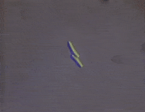

# Belly-Button-Biodiversity

   

## Visualizing the Belly Button Biodiversity dataset on an interactive dashboard with Plotly.js and D3 in Javascript to explore the relationships between demographics and the microbial colonies discovered within belly buttons. 
 
### Project Overview
Bellybuttons: everybody has one, and yet the microbial inhabitants within our navels remain a mystery to most of us. The Public Science Lab of NC State University created the Belly Button Biodiversity Project, an exploratory analysis that investigated the microbe colonies living inside the navels of hundreds of participants from varying backgrounds. All participants provided their demographic statistics to the study so it could be determined what relationships between microbe species and demographics existed. 

Molecular biology was conducted by the Public Science Lab at NC State to extract and sequence the DNA from the microbes collected from the participants’ belly buttons. Specifically, the 16S rRNA gene was analyzed, as it contains a molecular identifier use to distinguish one species of microbe from another. As a result, a list of microbial species and their quantities were produced to answer some of the following questions:

* What kind and how many species of bacteria live inside the belly button?
* Why are some species of bacteria so common while most other varieties are so rare?
* What are the determining factors that influence the volume and species of microbes found?

### Resources

#### Datasets

* Samples.json

#### Software

* Javascript
* HTML
* CSS
* Bootstrap
* Plotly.js
* D3.js Library

#### Results
In this project, a portion of the Belly Button Biodiversity dataset was used to create an interactive database that allows the user with to filter results by participant ID numbers. Bootstrap and CSS were used to style the webpage, while Plotly, Javascript and HTML created the charts and constructed the app itself.  

The dashboard features the following tools:

* A dropdown menu to select a participant, or test subject, identification number.
* A menu listing the demographical statistics for the test subjects that populates when an identification number is selected.
* A bar chart listing the top ten OTUs (operational axonomic units) discovered in descending order.
* A bubble chart listing all the OTUs (operational axonomic units) discovered, where outliers can also be observed. 
* A gauge chart that visualizes the number of weekly washes per test subject.

Once the web page app was created, it was deployed via Github and can be accessed using the link below:
https://jeaninemjordan.github.io/plotlydeploy.io/ 

#### Summary

This web application could be improved by expanding the search parameters to allow the user to view more comprehensive results from the dataset. Currently, the user can select identification numbers and view the results for individual test subjects.  An additional chart showing the comparison of the test subjects’ results to the overall results would be beneficial to this analysis. 

The results of the study conducted by the Public Science Lab at NC State University indicated that over 2,300 different species of microbes were discovered in just 60 navels. Only eight microbe species were present in more than 70% of the participants in large quantities, while the remaining species of bacteria were often so rare, they only appeared once per participant. The study found that the demographical factors (age, sex, ethnicity, location or frequency of bathing) did not have any affects on the microbial volumes or specie distributions discovered. While the bacteria species found in the participants’ belly buttons were highly diverse, their volumes were also predictable. 

#### About the Data

Hulcr, J. et al.(2012) A Jungle in There: Bacteria in Belly Buttons are Highly Diverse, but Predictable. Retrieved from: http://robdunnlab.com/projects/belly-button-biodiversity/results-and-data/ 
